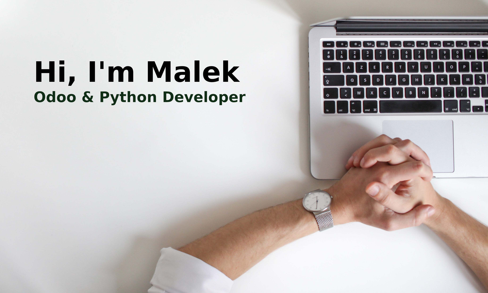

### Hi, i'm Malek :wave:
**Glad to see you here** :heart_eyes:

### About my

First and foremost, I love writing code. Ever since writing my first program in Python and manipulating it to produce a desired output, I have been obsessed with the idea of using software to solve practical problems. Software engineering is a never-ending puzzle that I am passionately engaged in solving. I believe in the power of programming to transform and improve the lives of people around the world.

### Get in touch
* **Linkedin** https://www.linkedin.com/in/malekshabab/
* **Facebook** https://www.facebook.com/MALEK8888/

<!--
**MalekShabab/MalekShabab** is a ✨ _special_ ✨ repository because its `README.md` (this file) appears on your GitHub profile.

Here are some ideas to get you started:

- 🔭 I’m currently working on ...
- 🌱 I’m currently learning ...
- 👯 I’m looking to collaborate on ...
- 🤔 I’m looking for help with ...
- 💬 Ask me about ...
- 📫 How to reach me: ...
- 😄 Pronouns: ...
- ⚡ Fun fact: ...
-->
